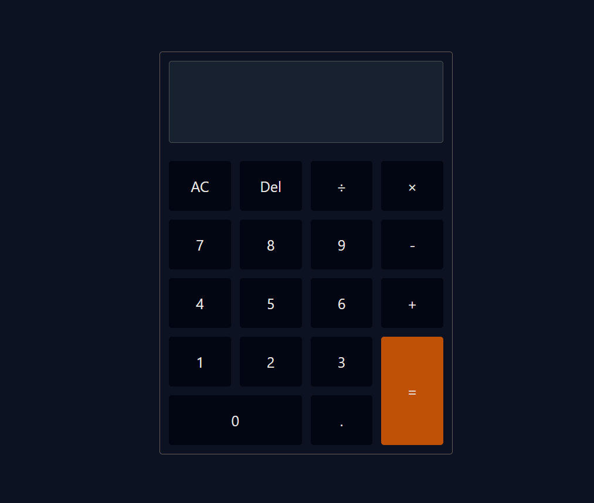

# Calculator App using `useReducer` Hook

This project is a simple calculator web application built using React's `useReducer` hook to manage state and handle user interactions. The primary goal of this project is to provide an in-depth explanation of how the `useReducer` hook works in the context of a real-world application.

## Demo

You can try out the live demo of the Calculator App [here](https://calculator-app-ss.netlify.app/).



[Demo Link](https://calculator-app-ss.netlify.app/)

## Introduction to `useReducer` Hook

The `useReducer` hook is a powerful tool in React for managing complex state logic. It offers an alternative approach to state management compared to the more commonly used `useState` hook. While `useState` is suitable for simple state updates, `useReducer` shines when dealing with more intricate state transitions and actions.

## Key Features

- **Arithmetic Operations**: Perform addition, subtraction, multiplication, and division operations.
- **Clear and Delete**: Clear the input or delete the last character.
- **Evaluate Expressions**: Calculate the result of entered expressions.
- **Decimal Point Control**: Prevent multiple decimal points in a single operand.
- **Operator Flexibility**: Change operators before entering the second operand.

## How `useReducer` is Utilized

The Calculator App showcases the implementation of the `useReducer` hook to manage the calculator's state and actions. The `reducer` function defines how state transitions occur based on dispatched actions. The app leverages this structure to handle user interactions effectively.

## Getting Started

To explore the inner workings of the `useReducer` hook in action, follow these steps:

1. Clone the repository:

```bash
git clone https://github.com/SOUMITRO-SAHA/calculator-app.git
```

2. Navigate to the project directory:

```bash
cd calculator-app
```

3. Install the dependencies:

```bash
npm install
```

4. Start the development server:

```bash
npm start
```

5. Open your browser and visit `http://localhost:3000` to interact with the app.

## Technologies Used

- React (utilizing `useReducer` hook)
- TailwindCSS (for styling)

## License

This project is licensed under the [MIT License](LICENSE).
